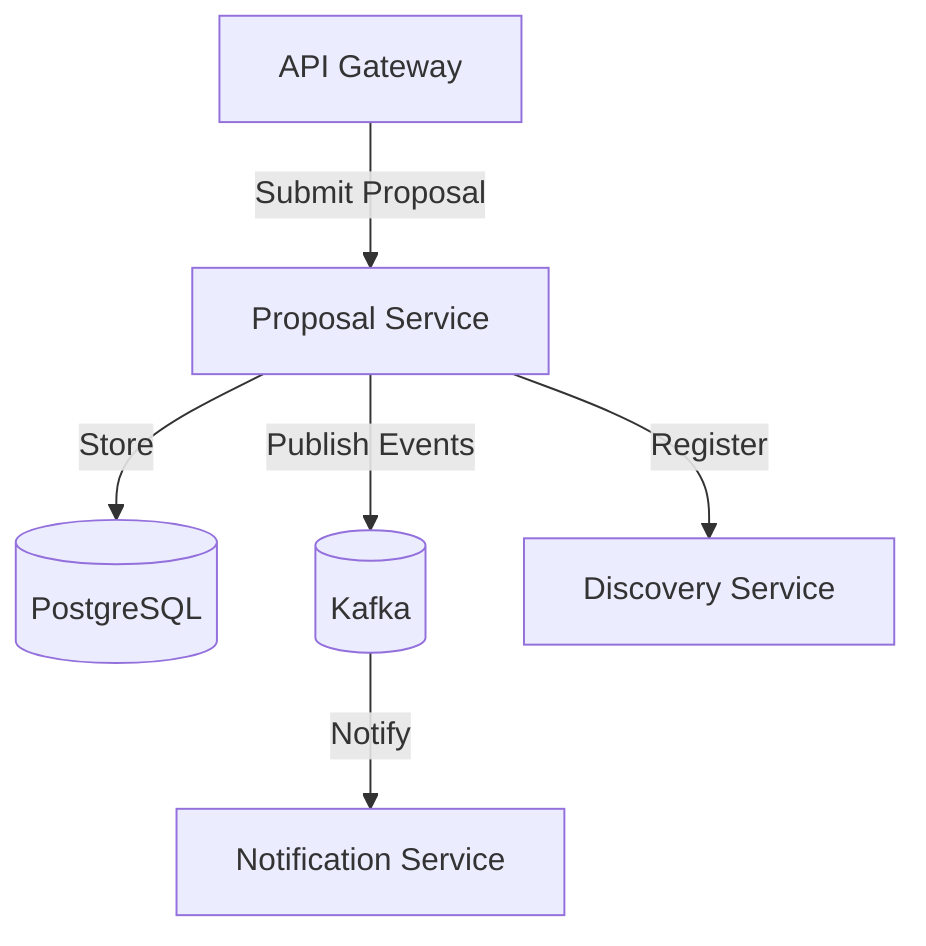

# Proposal Service

## Description
The Proposal Service manages the lifecycle of business proposals in the Offeria platform. It allows users to create, update, and track technical and commercial proposals in response to RFQs.

## Architecture Diagram


## File Structure
```text
proposal-service/
├── k8s/                  # Kubernetes manifests
├── src/
│   ├── main/
│   │   ├── java/offeria/proposal_service/
│   │   │   ├── application/ # Application Layer (DTOs, Services, Mappers)
│   │   │   ├── domain/      # Domain Layer (Entities, Repository Interfaces)
│   │   │   ├── infrastructure/ # Infrastructure Layer (Controllers, Config, Messaging)
│   │   │   ├── messaging/   # Common messaging logic
│   │   │   └── ProposalServiceApplication.java
│   │   └── resources/       # Configuration
│   └── test/                # Unit tests
├── Dockerfile           # Docker instructions
└── pom.xml              # Maven dependencies
```

## Technologies
- **Java 17**
- **Spring Boot 3**
- **Spring Data JPA**
- **Spring Kafka**
- **PostgreSQL**
- **Maven**

## Key Dependencies
- `spring-boot-starter-data-jpa`: Proposal persistence.
- `spring-kafka`: Event-driven architecture for proposal updates.
- `spring-cloud-starter-netflix-eureka-client`: Discovery client.

## Environment Variables
- `SPRING_PROFILES_ACTIVE`: Active profile.
- `EUREKA_CLIENT_SERVICEURL_DEFAULTZONE`: Discovery Service URL.
- `DB_URL`: JDBC URL for PostgreSQL.
- `DB_USERNAME`: PostgreSQL username.
- `DB_PASSWORD`: PostgreSQL password.
- `KAFKA_BOOTSTRAP_SERVERS`: Kafka bootstrap servers.
